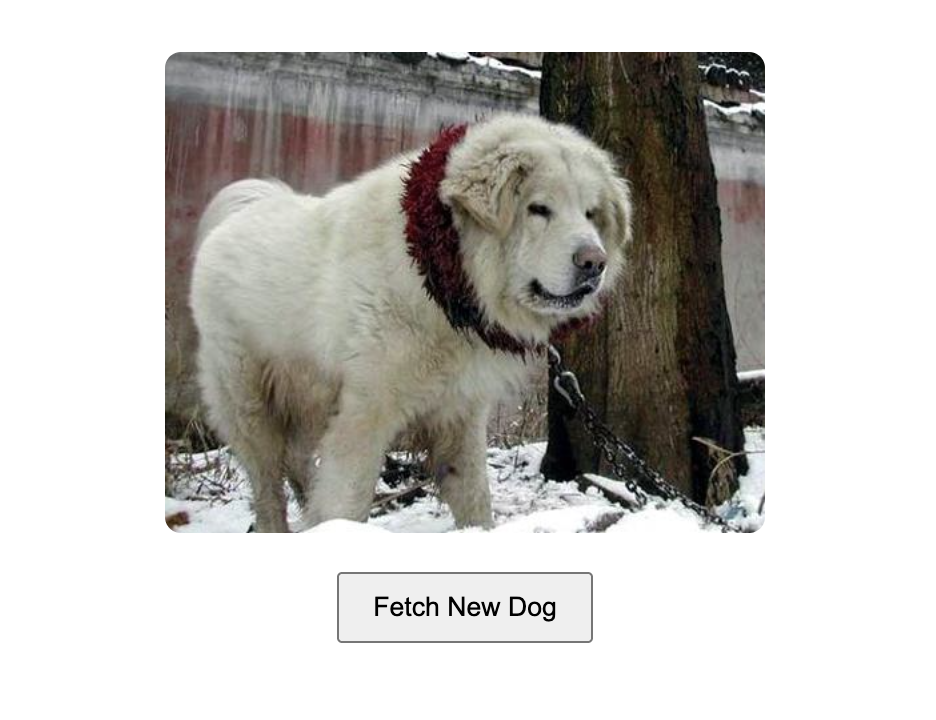

# 🐶 React Simple Data Fetching Lab

A simple React app that fetches and displays a random dog image from an external API using the `useEffect` hook. The user can also fetch a new dog image by clicking a button. A loading message is shown while data is being fetched.

---

## Learning Goals

- Use the `useEffect` hook to fetch data from an API when a component mounts.
- Use event handlers (like `onClick`) to fetch and update data.
- Manage asynchronous state updates and conditionally render UI.
- Follow React best practices for component structure and state management.

---

## Getting Started

### 1. Clone the Repo

```bash
git clone <your-forked-repo-url>
cd <project-directory>
```

### 2. Install Dependencies

```bash
npm install
```

### 3. Run the App

```bash
npm run dev
```

### 4. Run the Tests

```bash
npm run test
```

---

## How It Works

- The app fetches a random dog image from `https://dog.ceo/api/breeds/image/random` on initial render using `useEffect`.
- The app displays a `"Loading..."` message while the fetch is in progress.
- Once the image is loaded, it is displayed in an `` tag with `alt="A Random Dog"`.
- A `<button>` allows the user to fetch a new dog image on demand.

---

## Technologies Used

- React
- Vite
- JavaScript (ES6+)
- HTML/CSS
- [Dog CEO API](https://dog.ceo/dog-api/)
- Vitest and React Testing Library

---

## Best Practices Followed

- Used `useEffect` for side effects (API calls on mount).
- Kept components reusable and minimal.
- Removed unnecessary code and comments.
- Wrote tests and used `npm run test` to verify functionality.
- Passed all unit tests from the provided test suite.
- Screenshot added below.

---

## Screenshot

> Example display of a loaded dog image after fetching from the API:



---

## Git & Deployment Checklist

- [x] All unnecessary files/comments removed
- [x] Branches cleaned up on GitHub
- [x] `.gitignore` properly ignores node_modules and other sensitive data
- [x] Final version committed with meaningful messages

---

## Submission

Once complete:

1. Push your code to your forked GitHub repo.
2. Submit your GitHub repo link via Canvas using CodeGrade.

---

## Acknowledgements

Thanks to the [Dog CEO API](https://dog.ceo/dog-api/) for the random dog images!

---
